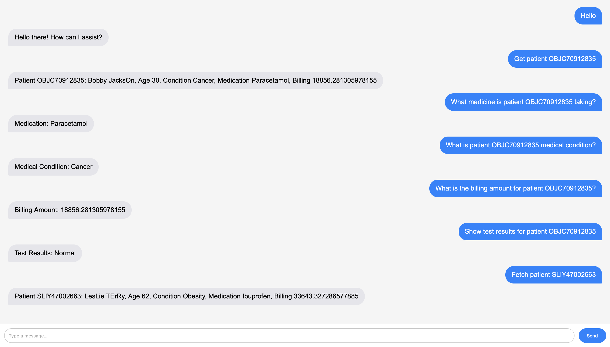

# UUMediBot

> A conversational healthcare chatbot for fetching patient information using AI and MongoDB.



---

## 🔍 Overview

UUMediBot is a Flask-based chatbot application that allows users to interactively retrieve patient details, medical conditions, medications, billing amounts, and more directly from a MongoDB database. It uses a TF-IDF vectorizer and a simple MLP classifier to identify user intents, complemented with regex-based pattern matching for rapid `{id}` lookups.

Key technologies:

* **Flask** for the web server and REST API
* **MongoDB** for patient data storage
* **scikit-learn** (TF-IDF + MLP) for intent classification
* **JavaScript & CSS** (Tailwind-inspired) for a modern chat UI

---

## ⚙️ Features

* **Intent Recognition**: Supports greetings, farewells, thanks, and fallback.
* **Patient Data Retrieval**: Fetch full profiles or specific fields:

  * Details (Name, Age, Condition, Medication, Billing)
  * Medical condition
  * Medication
  * Billing amount
  * Test results
  * Insurance provider
  * Admission/discharge dates
  * Blood pressure
* **Pattern-based `{id}` matching**: Recognizes queries like `What medicine is patient OBJC70912835 taking?` without retraining.
* **Responsive Chat UI**: Clean, bubble-style chat interface with header and online indicator.

---

## 🚀 Getting Started

### 1. Clone the repository

```bash
git clone https://github.com/<your-username>/UUMediBot.git](https://github.com/mDivya928/HealthCare-Chatbot.git)
cd HealthCare-Chatbot
```

### 2. Create & activate virtual environment

```bash
python3 -m venv venv
source venv/bin/activate   # macOS/Linux
venv\Scripts\Activate.ps1 # Windows PowerShell
```

### 3. Install dependencies

```bash
pip install -r requirements.txt
```

### 4. Prepare MongoDB

1. **Start** MongoDB (Homebrew or Docker).
2. **Import** your CSV data:

   ```bash
   mongoimport --db uumedi \
               --collection patient_details \
               --type csv --headerline \
               --file data/patient_details.csv
   ```

### 5. Train the model

```bash
python3 train_model.py
```

### 6. Run the server

```bash
export FLASK_APP=app
export FLASK_ENV=development
flask run
```

Open `http://127.0.0.1:5000` in your browser to start chatting!

---

## 📂 Project Structure

```
UUMediBot/
├── app/                     # Flask application
│   ├── __init__.py          # App factory & logging
│   ├── database.py          # MongoDB init
│   ├── utils.py             # Text cleaning & ID extraction
│   ├── routes.py            # Chatbot logic & endpoints
│   └── templates/           # HTML templates
│       └── index.html       # Chat UI
│   └── static/              # CSS/JS assets
│       ├── css/style.css
│       └── js/main.js
├── data/                    # Dataset & intents
│   ├── patient_details.csv  # Patient records
│   └── intents.json         # Intent definitions
├── models/                  # Pickled ML artifacts
│   ├── vectorizer.pkl
│   ├── label_encoder.pkl
│   └── intent_model.pkl
├── assets/                  # Media (screenshots)
│   └── chatbot_screenshot.png
├── train_model.py           # Model training script
├── requirements.txt         # Python dependencies
└── README.md                # Project overview and setup
```

---


